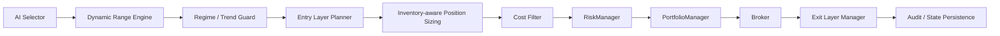

# Dynamic Range Inventory Strategy - Phase 1 Design

## 1. Goal

This document defines a **paper-first, backtestable** upgrade path for the current SOXS range-arbitrage system.

The goal is not to maximize raw profit at any cost. The goal is to improve:

- Sharpe
- Sortino
- Calmar
- Return / max drawdown
- Profit factor
- Capital utilization

While keeping the current hard protections intact:

- `global_reduce_only`
- fallback protection
- cash-only sizing for ordinary BUY
- pending-order deduplication
- PortfolioManager guard
- leveraged ETF exposure caps
- live fail-closed behavior

No production trading behavior is changed in Phase 1.

---

## 2. Current Call Chain

Current system flow as implemented in the repository:

```mermaid
flowchart LR
    A[AI Selector] --> B[Selection State / TOP configs]
    B --> C[TradingEngine]
    C --> D[RangeDetector]
    D --> E[BUY / SELL / STOP_LOSS signal]
    E --> F[OrderStateManager]
    F --> G[Fallback policy]
    G --> H[Cash sizing]
    H --> I[RiskManager]
    I --> J[PortfolioManager]
    J --> K[Broker]
    K --> L[Pending order / fill reconciliation]
    L --> M[Position update]
    M --> N[Exit logic / stop loss / take profit]
```



### Observed responsibilities

- **AI Selector**: candidate ranking and TOP generation only.
- **RangeDetector**: support / resistance based mean-reversion logic.
- **TradingEngine**: orchestration and hard buy/sell gating.
- **RiskManager**: stop loss, drawdown, cooldown, trade history.
- **OrderStateManager**: pending-order dedup and buying-power guard.
- **PortfolioManager**: portfolio-level risk guard.
- **Broker**: order submission and account/position access.

---

## 3. Current Strategy Risks

Main limitations observed in the current design:

1. Range is still too static in practice.
2. BUY is often delayed or blocked even when the stock remains inside the range.
3. No true strategy-level layered entry.
4. No true strategy-level layered exit.
5. Position sizing does not fully account for current inventory.
6. Trend invalidation detection is incomplete.
7. Time-stop is missing as a first-class strategy concept.
8. Trading cost and spread are not fully integrated into the strategy gate.
9. No proper walk-forward validation or parameter stability analysis.

This means the strategy often prefers safety over participation, which is acceptable for production protection but weak for return optimization.

---

## 4. Proposed Strategy Name

**Dynamic Range Inventory Strategy**

### Concept

Use AI only for selection quality and ranking.
Use a dynamic, volatility-aware range engine for execution timing.
Use inventory-aware sizing and layered exits to improve capital efficiency without relaxing safety rules.

### Core flow



---

## 5. Dynamic Range Design

### Objective

Replace the effective fixed range with a **volatility-aware dynamic range**.

### Candidate inputs

- ATR
- EMA / SMA
- rolling high / low
- Bollinger Bands
- realized volatility
- spread
- liquidity
- volume
- current regime

### Proposed output

Each calculation returns:

- `center`
- `support`
- `resistance`
- `grid_width`
- `range_width_pct`
- `range_quality`
- `valid_until`
- `data_timestamp`
- `calculation_version`

### Design rules

1. No future data.
2. Explicit lookback for every indicator.
3. Warm-up不足时 fail-closed.
4. Range too narrow -> no trade.
5. Spread too large relative to expected profit -> no trade.
6. Volatility expands -> range widens.
7. Volatility contracts -> range narrows.

### Example formula sketch

```text
center = EMA(lookback)
grid_width = ATR(atr_period) * atr_grid_multiplier
support = center - k1 * ATR
resistance = center + k2 * ATR
```

### Recommended configuration draft

```yaml
strategy:
  dynamic_range_enabled: false
  lookback_period: 20
  atr_period: 14
  atr_grid_multiplier: 1.5
  support_buffer: 0.20
  resistance_buffer: 0.20
  minimum_range_pct: 1.0
  maximum_range_pct: 12.0
  valid_for_minutes: 10
  warmup_bars: 30
```

---

## 6. Entry Layer Planner

### Objective

Split a single BUY into up to 5 layers.

### Default weights

- 25%
- 25%
- 20%
- 15%
- 15%

### Layer fields

- `layer_id`
- `trigger_price`
- `target_quantity`
- `filled_quantity`
- `average_fill_price`
- `status`
- `created_at`
- `filled_at`
- `exit_target`
- `stop_price`

### Hard rules

- No Martingale
- No “buy more just because price falls”
- One layer can fill only once
- Pending BUY blocks duplicate orders
- Inventory upper bound blocks further layers
- Trend guard can disable new layers
- Quantity 0 must not call broker
- Ordinary BUY uses cash only, not margin buying power

### Suggested config draft

```yaml
strategy:
  scaled_entry_enabled: false
  max_entry_layers: 5
  entry_layer_weights: [0.25, 0.25, 0.20, 0.15, 0.15]
  minimum_layer_spacing_atr: 0.5
  max_total_position_pct: 0.15
  leveraged_etf_max_position_pct: 0.10
```

---

## 7. Exit Layer Manager

### Objective

Replace the single exit target with layered exits.

### Modes

1. `layer_based`
   - each layer has its own entry / exit target
2. `portfolio_based`
   - total position exits in stages

### Recommended default

- `layer_based`

### Exit safety rules

- No duplicate SELL for the same layer
- Pending SELL blocks repeat submission
- SELL quantity cannot exceed actual broker position
- Orphan positions must still be monitored and exited
- reduce-only mode must still allow exits

### Suggested config draft

```yaml
strategy:
  scaled_exit_enabled: false
  take_profit_mode: layer_based
  take_profit_levels: [0.03, 0.05, 0.07, 0.10]
  take_profit_weights: [0.25, 0.25, 0.25, 0.25]
  minimum_profit_after_cost: 0.15
  trailing_profit_enabled: false
  trailing_profit_atr: 1.0
```

---

## 8. Inventory-aware Position Sizing

### Objective

Make new BUY size depend on current inventory, without breaking cash-only sizing.

### Inventory ratio

```text
inventory_ratio = current_position_value / allowed_position_value
```

### Suggested scaling

- 0% - 30%: 100% of base size
- 30% - 60%: 70%
- 60% - 80%: 40%
- 80%+: forbid new BUY

### Constraints

- `allowed_position_value` must be derived from config hard caps
- Leveraged ETFs get lower caps
- Cash reserve stays enforced
- AI score can influence base size only
- Inventory adjustment happens before broker API call

### Suggested config draft

```yaml
strategy:
  inventory_aware_sizing_enabled: false
  inventory_bands:
    - threshold: 0.30
      multiplier: 1.00
    - threshold: 0.60
      multiplier: 0.70
    - threshold: 0.80
      multiplier: 0.40
    - threshold: 1.00
      multiplier: 0.00
```

---

## 9. Trend Guard

### Objective

Detect when the range has failed and stop adding new inventory.

### Candidate inputs

- ADX
- EMA slope
- rolling breakout
- ATR expansion
- SOXX / SMH trend
- SOXS trend
- center drift
- consecutive entries without reversion

### Output

- `regime`
- `trend_score`
- `buy_allowed`
- `sell_allowed`
- `symbol_reduce_only`
- `cooldown_until`
- `trigger_reasons`

### Regimes

- `RANGE`
- `STRONG_UPTREND`
- `STRONG_DOWNTREND`
- `HIGH_VOLATILITY`
- `INVALID_RANGE`
- `UNKNOWN`

### SOXS-specific rule

When semiconductor index trend is strongly bullish:

- forbid new SOXS BUY
- still allow SELL
- still allow stop loss
- still allow take profit
- can switch symbol into reduce-only

### Suggested config draft

```yaml
strategy:
  trend_guard_enabled: false
  adx_threshold: 25
  ema_slope_threshold: 0.03
  breakout_lookback: 20
  max_consecutive_entries_without_reversion: 2
  symbol_reduce_only_on_trend_break: true
```

---

## 10. Stop Loss and Invalidation Exit

### Objective

Use layered exit logic instead of a single fixed percentage.

### Exit hierarchy

1. Layer stop loss
2. Total position max loss
3. Dynamic support failure
4. ATR stop
5. Time stop
6. Trend guard exit
7. Max holding days
8. Max consecutive entry layers

### Suggested rule

Use a conservative stop level derived from both fixed loss and ATR buffer:

```text
stop_loss_price = support - ATR * buffer
```

Apply directionally correctly for long positions.

### Suggested config draft

```yaml
strategy:
  time_stop_enabled: false
  max_holding_minutes: 240
  max_holding_days: 3
  max_position_loss_pct: 0.05
  stop_atr_multiplier: 1.0
  support_break_confirmation_bars: 2
  cooldown_after_stop_minutes: 30
```

---

## 11. Trade Cost Filter

### Objective

Do not open positions when the edge is smaller than trading cost.

### Estimate

- commission
- platform fee
- spread
- slippage
- expected gross profit
- expected net profit

### Gate

Only allow trade when:

```text
expected_net_profit > minimum_net_profit
and
spread / expected_gross_profit < max_spread_profit_ratio
```

### Suggested config draft

```yaml
strategy:
  cost_filter_enabled: false
  minimum_net_profit: 0.20
  max_spread_profit_ratio: 0.25
  commission_estimate: 0.05
  platform_fee_estimate: 0.02
  slippage_estimate: 0.05
```

---

## 12. State Persistence Design

Each symbol should persist:

- `strategy_version`
- `active_range`
- `range_timestamp`
- `entry_layers`
- `exit_layers`
- `realized_pnl`
- `unrealized_pnl`
- `inventory_ratio`
- `trend_guard_state`
- `symbol_reduce_only`
- `last_buy_time`
- `last_sell_time`
- `cooldown_until`
- `last_reconciliation_time`
- `broker_position_snapshot`
- `state_version`

### Persistence requirements

- Atomic write
- Schema version
- Backward compatible
- Broker reconciliation
- Fail closed if inconsistent

### Suggested storage path

```text
state/strategy_state/<SYMBOL>.json
state/strategy_state/index.json
```

### Reconciliation rule

- Broker always wins if local state disagrees with live/paper/sandbox account
- Unknown state => no new BUY
- Existing SELL / reduce-only exits remain allowed

---

## 13. Recommended Modules

### New modules

- `src/strategy/dynamic_range.py`
- `src/strategy/entry_layers.py`
- `src/strategy/exit_layers.py`
- `src/strategy/inventory_sizing.py`
- `src/strategy/trend_guard.py`
- `src/strategy/trade_cost.py`
- `src/strategy/state_store.py`
- `src/backtest/strategy_backtester.py`
- `src/backtest/walk_forward.py`

### Likely modified modules

- `src/engine/trading_engine.py`
- `src/strategy/range_detector.py`
- `src/engine/position_sizing.py`
- `src/portfolio/manager.py`
- `src/portfolio/risk_allocator.py`
- `src/order/order_state.py`
- `src/reports/trade_audit.py`
- `src/dashboard/combined.py`

### Modules that should not be changed in Phase 1

- `src/broker/longbridge_broker.py`
- `src/broker/paper_broker.py`
- `src/risk/manager.py`
- `src/ai_selector/selector.py`
- `src/ai_selector/config_writer.py`

---

## 14. Feature Flags

All new strategy features must default to `false`.

```yaml
strategy:
  dynamic_range_enabled: false
  scaled_entry_enabled: false
  scaled_exit_enabled: false
  inventory_aware_sizing_enabled: false
  trend_guard_enabled: false
  cost_filter_enabled: false
  time_stop_enabled: false
```

### Environments

- **PROD**: default off, must stay off unless explicitly approved
- **SANDBOX**: can be enabled later for validation
- **PAPER**: primary validation environment

---

## 15. Phase Plan

### Phase 1

- Write design docs
- Finalize parameter schema
- Finalize state schema
- Finalize backtest plan
- Do not change production behavior

### Phase 2

- Implement dynamic range calculations
- Implement inventory-aware sizing
- Implement entry / exit layers
- Connect only to PaperBroker

### Phase 3

- Run historical backtests
- Produce baseline comparison
- Evaluate stability, not only return

### Phase 4

- Add feature flags to production config
- Keep them disabled by default
- Small paper validation only

---

## 16. Phase 1 Risk Assessment

### Main risks

1. Strategy drift from the current conservative behavior.
2. Accidental coupling into the production execution path.
3. Overfitting to one ticker or one volatility regime.
4. Hidden use of future data in range or trend calculations.
5. New persistence bugs causing repeated orders after restart.

### Mitigations

- Keep flags off by default
- Use explicit versioning
- Do not modify Broker or RiskManager in Phase 1
- Backtest across multiple regimes and tickers
- Require broker reconciliation on restart
